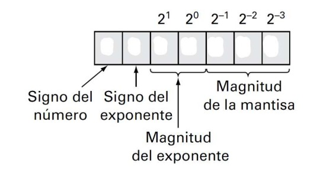
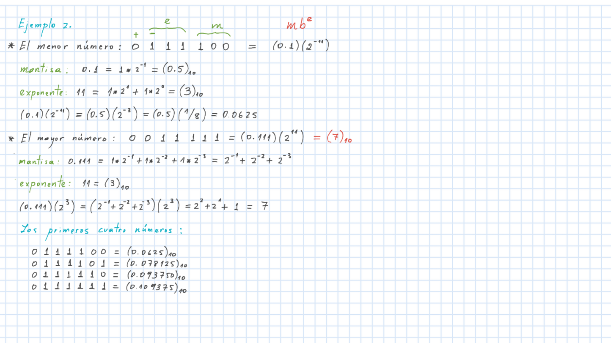
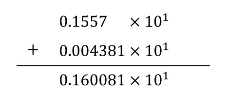
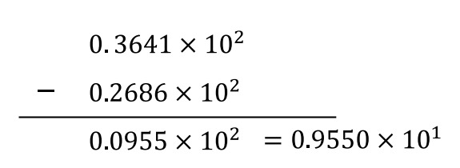
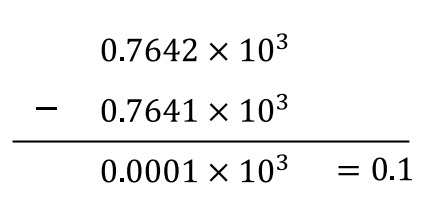
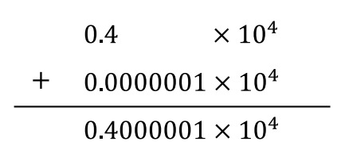
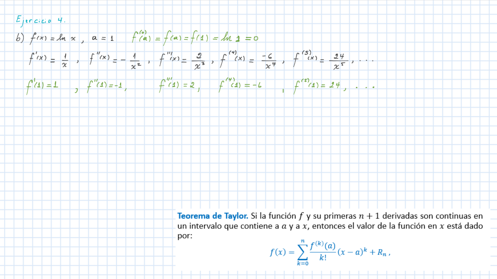

# Errores de redondeo:

## Ejemplo 2: Conjunto hipotetico de numeros con punto flotante
Determine el menor y el mayor numeros positivos que puede almacenar una maquina que utiliza
representación de punto flotante en cadenas de 7 digitos binarios. El primer bit se emplea 
para el signo del numero, los siguientes tres para el signo y la magnitud del exponente, 
y los ultimos tres para la magnitud de la mantisa.

### Para tener en cuenta.
El intervalo entre los números está relacionado con el épsilon de la máquina (menor número generado
por una máquina tal que al sumárselo a 1 el resultado es mayor que 1) que se calcula con la
expresión, donde es el número de dígitos significativos en la mantisa.

Los computadores permiten una precisión adecuada bajo el formato IEEE en el que se utilizan 24 bits
en la mantisa (32 bits en total para el número), lo que representa cerca de 7 cifras significativas
de precisión en dígitos de base 10 con un rango aproximado de $10^{-38}$ a $10^{39}$.
Existen dos tipos de precisión extendida: _precisión doble_ (64 bits  en total, 52 bits para la
mantisa, de 15 a 16 dígitos decimales de precisión, rango aproximado de $10^{-308}$ a $10^{308}$) y
_precisión cuádruple_ (128 bits en total)

## Operaciones aritméticas comunes
Las operaciones de adición, sustracción, multiplicación y división se ven afectadas por los errores
de redondeo generados al almacenar los números reales. La adición y sustracción de dos números de
punto flotante requiere que el número de la mantisa con el menor exponente se modifique de tal 
forma que los exponentes sean los mismos.

## Ejemplo 3: Realizar las siguientes operaciones:
$$0.1557 * 10^{1} + 0.4381 * 10^{-1} $$

$$36.41 - 26.86$$

$$0.7642 * 10^{3} - 0.7641 * 10^{3} $$

$$ 4000 + 0.0010 $$

# Medición de errores:
## Error verdadero
$E_t$: $\text{|valor verdadero - valor aproximado|}$

## Error relativo fraccional verdadero
$\frac{|\text {Error verdadero}|} {| \text {Valor verdadero}|}$

## Error relativo porcentual verdadero
$E_t =$ $\frac{|\text {Error verdadero}|} {| \text {Valor verdadero}|}$ $x100\%$

## Error aproximado porcentual
$E_a =$ $\frac{|\text {Error aproximado}|} {| \text {Valor aproximado}|}$ $x100\% =$
$\frac{|\text {Aprox. actual - Aprox.ant.}|} {| \text{Aproximación actual}|}$ $x100\%$

## Cancelación por resta
Tanto la suma de un número grande con un número pequeño como la resta de dos números flotantes casi
iguales generan dificultades aritméticas que pueden solucionarse reescribiendo el orden de las
operaciones.

## Ejemplo 4:
La fórmula general para solucionar la ecuación cuadrática:
$$ax^{2} + bx + c=0$$
Puede reescribirse como se muestra a continuación:
$$\frac {-b \pm \sqrt {b^2 - 4ac}}{2a} = \frac {\pm \sqrt {b^2 - 4ac}-b} {2a} = \left ( \frac {\pm \sqrt {b^2 - 4ac}-b} {2a} \right ) * \left ( \frac {\pm \sqrt {b^2 - 4ac} + b}{\pm \sqrt {b^2 - 4ac} + b} \right ) =  \frac {{b^2 - 4ac - b^2}} {2a(\pm \sqrt {b^2 - 4ac} + b)} = \frac {-2c}{b \pm \sqrt {b^2 - 4ac}}$$

## Ejercicio 3.
Considere la ecuación de segundo grado:
$$ax^{2} + bx + c=0$$
donde $a = 1, b = 3000.001, c= 3$
- Halle las dos soluciones $(m_1,m_2)$ de la ecuación cuadratica utilizando la expresión:
    
    $$\frac {-b \pm \sqrt {b^2 - 4ac}}{2a}$$

- Halle las dos soluciones $(p_1, p_2)$ de la ecuación cuadrática utilizando la expresión:

    $$\frac {-2c}{b \pm \sqrt {b^2 - 4ac} }$$

- Compare sus resultados con las soluciones correctas (Utilice el comando `solveset` disponible en 
el modulo `sympy`)

[Exercise3](class5.py)

# Errores de Truncamiento
Un número $x$ está truncado a _n_ digitos  o números cuando todos los dígitos que siguen al 
_n_-ésimo dígito son descartados.

*Teorema de Taylor.* 
Si la función $f$ y su primeras $n + 1$ derivadas son continuas en un intervalo que contiene a $a$
y a $x$, entonces el valor de la función en $x$ está dado por: 

$$ f(x) = \sum_{k=0}^{n} \frac{f^{k} (a)}{k!} (x-a)^{k} + R_n $$

donde el residuo, $R_n$, puede definirse como:

$$R_n = \int_{a}^{x} \frac{(x-t)^{n}}{n!} f^{n+1} (t) dt$$
$$ó$$
$$R_n = \frac{f^{(n+1)} (\xi)}{(n+1)!} (x-a)^{n+1} $$

Si se omite el residuo, el lado derecho de la igualdad es el polinomio de Taylor de grado $n$ para
$f(x)$.

$$f(x) = \sum_{k=0}^{n} \frac{f^{k}(a)}{k!} (x - a)^{k} + R_n$$

$$R_n = \frac{f^{n+1}(\xi)}{(n+1)!} (x - a)^{n+1}$$

## Ejemplo 5.
La serie de Taylor para $f(x) = e^{x}$ en $a = 0$ se obtiene calculando las derivadas de 
$f(f{^k}(x) = e{^x} \text {para k}\geq 0)$ y evaluándolas en a
($f{^k}(a) = f{^k}(0) = e{^0} = 1$).

$$e^{x}\sum_{k=0}^{n} \frac{x^{k}}{k!} + \frac{e^{\xi}}{(n+1)!} x^{n+1}$$

Para comprobar que la representación en serie converge a la función $f(x) = e^{x}$ consideramos un 

número $x$ en el intervalo $[-s,s]$. Entonces $|x|\leq s$, $|\xi| \leq s$ y $e^{\xi} \leq e^{s}$:

$$\left | \frac{e^{\xi}}{(n + 1)!} x^{n+1} \right | \leq \frac{e^{s}}{(n+1!)} s^{n+1} \Rightarrow \lim_{\infty} \frac{e^{s}}{(n+1!)} s^{n+1} = 0$$

## Ejercicio 4:
Halle la serie de Taylor para la función y el valor de $a$ que se indica en cada caso. Escriba un 
código computacional que le permita graficar la función dada y los polinomios de Taylor de grado
0, 1, 2, 3, 4 y 5.

[Codigo 4](Exercise4.py)

- $f(x) = cos(x), a=0$
    [Codigo ejercicio 4a](Exercise4a.py)
- $f(x) = ln(x), a=1$
    [Codigo ejercicio 4b](Exercise4b.py)
- $f(x) = 3x{^5} - 2x{^4} + 15x{^3} + 13x{^2} - 12x - 5 , a=2$
    [Codigo ejercicio 4c](Exercise4c.py)

## Ejercicio 5:
Utilice los polinomio de Taylor de grados 0, 1, 2, 3, 4 y 5 hallados en los literales a) y b) del 
ejercicio anterior para aproximar $cos(\pi/3)$ y $\ln(2.5)$ , respectivamente. Calcule el error 
relativo porcentual de cada aproximación.

## Ejercicio 6:
Revise, estudie y solucione los problemas propuestos al final del capítulo 3 (página 62) del texto 
Chapra, S. C., & Canale, R. P. (2011). Métodos numéricos para ingenieros. Mexico: McGraw-Hill Ed 7.
