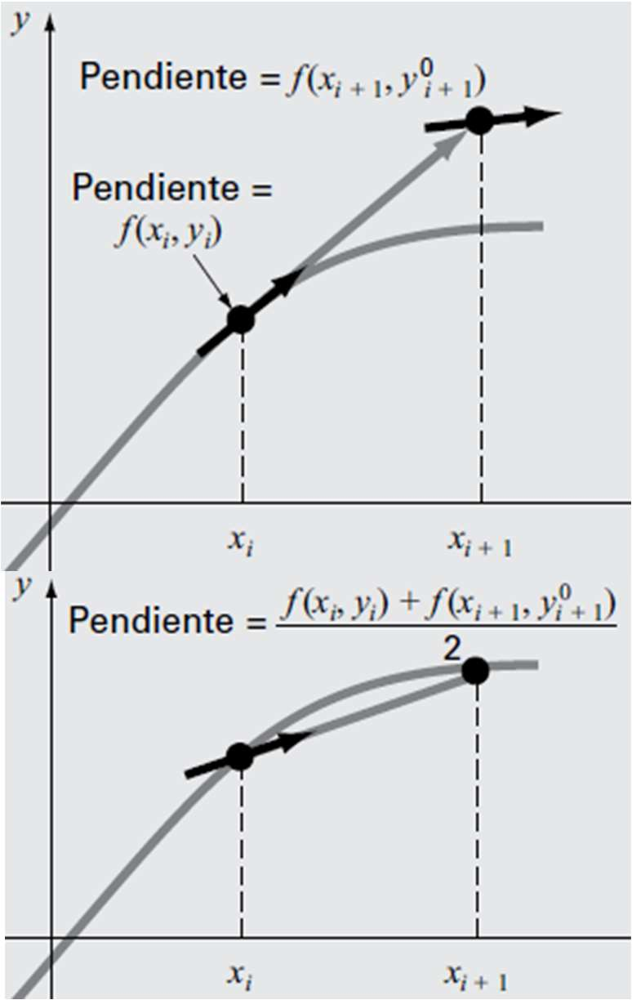

# PVI - Método de Euler
$${y}' = f(x,y), y_{i+1} = y_{i} + f(x_{i}, y_{1})h$$

## Ejemplo 1. El siguiente PVI
$$\left\{\begin{matrix} {y'(t)} = y & \\ y(0) = 1 & \end{matrix}\right.$$

tiene por solución analítica la función $y = e^t$. El método de Euler permite obtener una solución 
numérica luego de establecer un tamaño de paso, $h = 0.2$ , y un intervalo de solución como [0,2].

$t_{0} = 0, y_{0} = y(t_{0}) = y(0) = 1$

$t_{1} = t_{0} + h = 0 + 0.2 = 0.2$

$y_{1} = y_{0} + f(t_{0}, y_{0})h = 1 + (y_0)(0.2) = 1 + (1)(0.2) = 1.2$

$t_{2} = t_{1} + h = 0.2 + 0.2 = 0.4$

$y_{2} = y_{1} + f(t_{1}, y_{1})h = 1.2 + (y_1)(0.2) = 1.2 + (1.2)(0.2) = 1.2 + 0.24 = 1.44$

Si se continúan los cálculos:
$t_{10} = 2 \text {y} y_{10} = y(t_{10}) = 6.192$

## Ejemplo 2. El siguiente PVI
$$\left\{\begin{matrix} {y'(x)} = -2x^3 + 12x^2 - 20x + 8.5 & \\ y(0) = 1 & \end{matrix}\right.$$

tiene por solución analítica la función $y = -0.5x^4 + 4x^3 - 10x^2 - 8.5x + 1$. Si establecemos un
tamaño de paso $h=0.5$ y un intervalo de solución [0,4], el método de Euler conduce a:

$x_{0} = 0, y_{0} = y(x_{0}) = y(0) = 1$

$x_{1} = x_{0} + h = 0 + 0.5 = 0.5$

$y_{1} = y_{0} + f(x_{0}, y_{0})h = 1 + (-2x^3_0 + 12x^2_0 - 20x_0 + 8.5)(0.5) = 5.25$

$x_{2} = x_{1} + h = 0.5 + 0.5 = 1$

$y_{2} = y_{1} + f(x_{1}, y_{1})h = 5.25 + (-2x^3_1 + 12x^2_1 - 20x_1 + 8.5)(0.5) = 5.875$

Si se continúan los cálculos:
$x_{8} = 4 \text {y} y_{8} = y(x_{8}) = 7$

## PVI - Metodo de Heun
El método de Heun mejora la estimación del método de Euler
porque aproxima el valor de $y_{i+1}$ utilizando un promedio de las
derivadas en $x_i \text {y} x_{i+1}$. El método de Euler sólo utiliza la derivada en $x_i$.

### Algoritmo
1. Calcular pendiente al inicio del intervalo:
$y_i' = f(x_{i}, y_{i})$
2. Calcular (utilizando Euler):
${y_{i+1}^{0}} = y_i + f(x_{i}, y_{i})h$
3. Calcular pendiente al final del intervalo:
${y_{i+1}^{'}} = f(x_{i+1}, y_{i+1}^{0})$
4. Promediar pendientes:
$\overline{m} = \frac{f(x_{i},y_{i})+f(x_i+1, y_i^{0}+1)}{2}$
5. Calcular (utilizando Euler):
$y_{i+1} = y_i + \overline{m}h$

## PVI - Punto Medio
El método del punto medio predice un valor ${y_{i+1/2}^{0}}$ para utilizarlo en la estimación de la
pendiente en el punto $x_{i+1/2},y_{i+1/2}$ A su vez, la pendiente calculada es utilizada para 
obtener $y_{i+1}$

### Algoritmo
1. Calcular pendiente al inicio del intervalo:
$y_i' = f(x_{i}, y_{i})$
2. Calcular:
$y_{i+1/2} = y_i + f(x_{i}, y_{i})\frac{h}{2}$
3. Calcular pendiente al final del intervalo:
${y_{i+1}^{'}} = f(x_{i+\frac{1}{2}}, y_{i+\frac{1}{2}})$
4. Calcular:
${y_{i+1}} = y_{i} + f(x_{i+\frac{1}{2}}, y_{i+\frac{1}{2}})$

# Examen Viernes 03/03/2023
- Sintaxis Python
- Errores (Almacenamiento de información)
- PVI (Primera clase)

# Proyecto
- Problemas de valores en la frontera