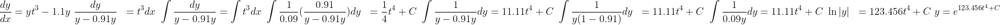
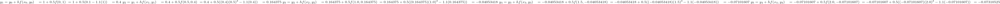
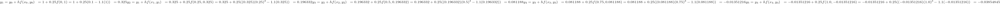
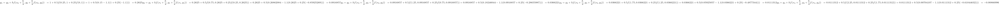
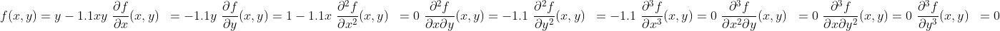
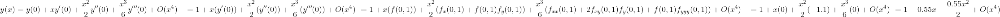

# PVI: Métodos de Euler, Heun, Punto medio y Métodos de la serie de Taylor.
Resuelva el siguiente problema de valor inicial en el intervalo de t = 0 a 2, donde y(0) = 1. Muestre todos sus resultados en la misma gráfica. 
$\frac{dy}{dx} = yt^{3} - 1.1y$
* Analiticamente
* Método de Euler con h = 0.5 y 0.25
* Método de punto medio con h = 0.5
* Método de la serie de Taylor de orden 3.

### Analíticamente:
Primero, podemos obtener la solución analítica de la ecuación diferencial dada:

Utilizando la condición inicial $y(0) = 1$, podemos encontrar el valor de la constante de integración C:
$$y(0) = e^{C}$$
$$1 = e^{C}$$
$$C = 0$$

Por lo tanto, la solución analítica del problema de valor inicial es:

$$y = e^{123.456t^4}$$

### Método de Euler:

Aplicando el método de Euler con $h=0.5$ y $h=0.25$:

Para $h=0.5$:

Para $h=0.25$:

### Método de Punto Medio:

Aplicando el método de punto medio con $h=0.5$:

Por lo tanto, la solución aproximada usando el método de punto medio con $h=0.5$ es:
y(0)≈1, y(0.5)≈0.2625, y(1.0)≈0.0916857, y(1.5)≈0.0366221, y(2.0)≈−0.00866996

### Método de la serie de Taylor de orden 3.

Ahora, podemos usar la serie de Taylor de orden 3 para aproximar la solución $y(x)$:

Por lo tanto, la solución aproximada usando el método de la serie de Taylor de orden 3 es:
y(0)≈1,y(0.5)≈0.725,y(1.0)≈0.25875,y(1.5)≈−0.078375,y(2.0)≈−0.2925