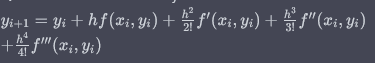

PVI: Métodos de Euler, Heun, Punto medio y Métodos de la serie de Taylor. 
Resuelva el siguiente problema en el intervalo de x = 0 a 1, usando un tamaño de paso de 0.25, donde y(0) = 1. Muestre todos sus resultados en la misma gráfica. 
$\frac{dy}{dx}= (1+ 4x)\sqrt{y}$
- Analiticamente
- Método de Euler con h = 0.5 y 0.25
- Método de punto medio con h = 0.5
- Método de la serie de Taylor de orden 3.

### Analiticamente:
$y(x)=(\frac {x^{2}}{4}+{x}+1)^2$

### Euler:
$$y_{i+1} = y_i + hf(x_i, y_i)$$
$$y_{i+1} = y_i + h(1, 4x_i)\sqrt(y_i)$$

Para $h=0.5$:
$$y_{1} = y_0 + 0.5(1, 4(0))\sqrt(y_0)=1.0$$
$$y_{2} = y_1 + 0.5(1, 4(0.5))\sqrt(y_1)​=2.424$$
$$y_{3} = y_2 + 0.5(1, 4(1.0))\sqrt(y_2)​=5.035$$

Para $h=0.25$:
$$y_{1} = y_0 + 0.25(1, 4(0))\sqrt(y_0)=1.0$$
$$y_{2} = y_1 + 0.25(1, 4(0.25))\sqrt(y_1)​=1.936$$
$$y_{3} = y_2 + 0.25(1, 4(0.5))\sqrt(y_2)​=3.343$$
$$y_{4} = y_3 + 0.25(1, 4(0.75))\sqrt(y_3)​=5.785$$

### Punto medio:
$$y_{i+1} = y_i + hf(x_i + \frac{h}{2}, y_i\frac{h}{2}f(x_i,y_i))$$
$$y_{i+1} = y_i + hf(1 +  4(x_i + \frac{h}{2}), \sqrt{y_i + \frac{h}{2}(1+4x_i)\sqrt{(y_1)}})$$

Para $h=0.5$
$$y_{1} = y_0 + 0.5(1 + 4(0 + \frac{0.5}{2})\sqrt {y_0\frac{0.5}{2}f(1 + 4 (0)\sqrt{(y_0)})}=1.207$$

$$y_{2} = y_1 + 0.5(1 + 4(0 + \frac{0.5}{2})\sqrt {y_1\frac{0.5}{2}f(1 + 4 (0.5)\sqrt{(y_1)})}=2.6333$$

$$y_{3} = y_2 + 0.5(1 + 4(0 + \frac{0.5}{2})\sqrt {y_1\frac{0.5}{2}f(1 + 4 (1.0)\sqrt{(y_2)})}=5.214$$

### Punto de taylor:

Donde:
La derivada primera de $f$ es:

La derivada 3° de $f$ es:
$$f'''(x,y) = \frac{384}{y^{5/2} + 75y(20x^3+3x)+10(40x^5+30x^3+3)x+1}$$
$$ = \frac{384}{y^{5/2} + 150xy^2+75y+120x^5+90x^3+9x}$$

Para $h=0.25$
$$y_1 = y_0 + 0.25\left(1+4(0)\right)y_0 + \frac{0.25^2}{2!}f'(0,1) = 1.0$$
$$y_2 = y_1 + 0.25\left(1+4(0.25)\right)y_1 + \frac{0.25^2}{2!}f'(0.25,1) + \frac{0.25^3}{3!}f''(0.25,1.949) = 1.949 $$
$$y_3 = y_2 + 0.25\left(1+4(0.5)\right)y_2 + \frac{0.25^2}{2!}f'(0.5,1.949) + \frac{0.25^3}{3!}f''(0.5,3.280) = 3.280 $$
$$y_4 = y_3 + 0.25\left(1+4(0.75)\right)y_3 + \frac{0.25^2}{2!}f'(0.75,3.280) + \frac{0.25^3}{3!}f''(0.75,5.663) = 5.663$$